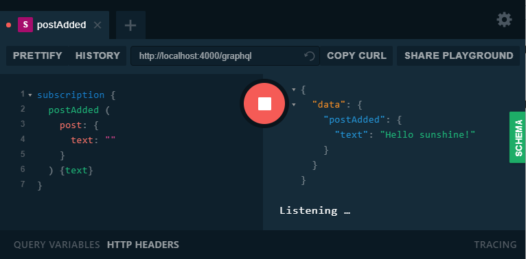

# boilerplate-graphql




# Install

```javascript
cd server
npm install
```

```javascript
cd client
npm install
```

# Start

```javascript
cd server
npm start
```

```javascript
cd client
npm start
```
# Usage

Post added (Listen for subscriptions):

```javascript
subscription {
  postAdded (
    post: {
      text: "Hello world!"
    }
  ) {text}
}
```

Add post:

```javascript
mutation {
  addPost (
    post: {
      text: "Good morning, sunshine!"
    }
  ) {text}
}
```